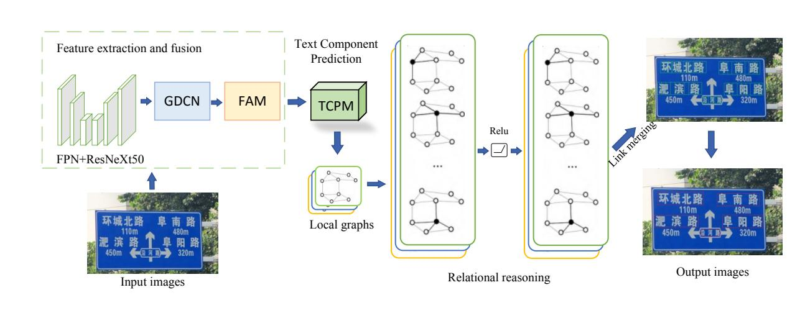

<<<<<<< HEAD
# CR2-Net: Component Relationship Reasoning Network for Traffic Text Detection

This is a pytorch-based implementation for paper [CR2-Net](https://ieeexplore.ieee.org/abstract/document/10552116) (IEEE Transactions on Intelligent Vehicles). This repository is built on the pytorch [maskrcnn](https://github.com/facebookresearch/maskrcnn-benchmark).


## News
(2024/10/19) Code is released.

## Requirements
The version we used is    pytorch==1.7.0   torchvision==0.8.0 cudatoolkit=11.0

### Step-by-step install

```bash
  conda create --name CR2-Net
  conda activate CR2-Net
  conda install ipython
  pip install ninja yacs cython matplotlib tqdm scipy shapely networkx pandas
  conda install pytorch==1.7.0 torchvision==0.8.0 cudatoolkit=11.0
  conda install -c menpo opencv
  export INSTALL_DIR=$PWDcd $INSTALL_DIR
  git clone https://github.com/cocodataset/cocoapi.git
  cd cocoapi/PythonAPI
  python setup.py build_ext install
  cd $INSTALL_DIR
  git clone https://github.com/runminwang/CR2-Net.git
  cd CR2-Net
  python setup.py build develop
```
## Results

Experimental Results on general natural scene text datasets ICDAR 2015  and SCUT-CTW1500 Datasets.
| Dataset          | Recall | Precision | F-measure |
|:-----------------|:---------:|:---------:|:---------:|
| [ICDAR 2015](https://rrc.cvc.uab.es/?ch=4) | 84.8   |   89.2   |    86.9   |
| [CTW-1500](https://github.com/Yuliang-Liu/Curve-Text-Detector) | 78.6| 86.2  | 82.2  |

Experimental Results on traffic text datasets CTST-1600  and TPD  Datasets.
| Dataset          | Recall | Precision | F-measure |
|:-----------------|:--------:|:---------:|:---------:|
| CTST1600 | 86.9   |   91.3    |    89.0   |
| TPD | 92.7 | 91.3  | 92.1 |

## Initialize the backbone
There is one strategies to initialize the parameters in the backbone: use the ResNet50 model (ImageNet)[BAIDU](https://pan.baidu.com/s/1nYePd4BgsBjhToeD2y1RbQ)(passward:edt8)   or [Drive](https://drive.google.com/file/d/1GZRktoRS4hoXmsCrucl3liLyMzl56WK7/view?usp=sharing),   this is provided by [Yuliang](https://github.com/Yuliang-Liu/Box_Discretization_Network),   which is ONLY an ImageNet Model With a few iterations on ic15 training data for a stable initialization.

## Experiment on ICDAR 2015 dataset
### Data preparing 
#### step 1
   Prepare data follow COCO format or you can download our IC15dataset [BAIDU](https://pan.baidu.com/s/1GbF0PnWDKw3qn2o2XgpB7Q) (passward:ect5) or [Geogle Drive](https://drive.google.com/file/d/1ZWRQWJwhydoCsqdNlX80y94cKQedUywO/view?usp=sharing),and unzip it in 
```bash
   datasets/.
```
#### step 2
You need to modify ```maskrcnn_benchmark/config/paths_catalog.py```to point to the location where your dataset is stored.

### Train  on IC15

Run
```bash 
   python tools/test_net.py  --config-file "./configs/icdar2015/r50_baseline.yaml"
```
### Test IC15
Run
```bash 
   python -m torch.distributed.launch --nproc_per_node=$NGPUS tools/test_net.py \
	--config-file "./configs/icdar2015/r50_baseline.yaml"
```
### Evaluate
Put bo.json to ic15_evaluate/, then run
```bash 
   cd ic15_evaluate
   conda deactivate
   pip2 install polygon2
   conda install zip
   python2 eval_ic15
```

## Experiment on CTW dataset
### Data preparing 
#### step 1
   Prepare data follow COCO format or you can download our CTW-dataset [Baidu](https://pan.baidu.com/s/1Ie042iJdLzU6prBI9zu_Tw)(jeec)[Drive](https://drive.google.com/file/d/1YbohYSs4T6yyVMEYCpr18fzKiUWzYVOe/view?usp=sharing), and unzip it in
```bash 
   output/.
```
#### step 2
   You need to modify ```maskrcnn_benchmark/config/paths_catalog.py```to point to the location where your dataset is stored.

### Train on CTW

Run
```bash 
   python tools/test_net.py  --config-file "./configs/ctw/r50_baseline.yaml"
```
### Test CTW
Run
```bash 
     python -m torch.distributed.launch --nproc_per_node=$NGPUS tools/test_net.py \
	--config-file "./configs/ctw/r50_baseline.yaml"
```
### Evaluate
Run
```bash 
   cd ctw_eval
   python eval_ctw1500.py
```

## Experiment on TPD dataset
### Train on TPD
Run
```bash 
   python tools/test_net.py  --config-file "./configs/tpd/r50_baseline.yaml"
```
### Test TPD
Run
```bash 
     python -m torch.distributed.launch --nproc_per_node=$NGPUS tools/test_net.py \
	--config-file "./configs/tpd/r50_baseline.yaml"
```
### Evaluate
Run
```bash 
   cd tpd_evaluate
   python eval_tpd.py
```
## Experiment on CTST-1600 dataset
### Train on CTST-1600

Run
```bash 
   python tools/test_net.py  --config-file "./configs/ctst1600/r50_baseline.yaml"
```
### Test CTST-1600
Run
```bash 
     python -m torch.distributed.launch --nproc_per_node=$NGPUS tools/test_net.py \
	--config-file "./configs/ctst1600/r50_baseline.yaml"
```
### Evaluate
Run
```bash 
   cd ctst1600_evaluate
   python eval_ctst1600.py
 ```
# Improvement
1) We explored a GCN-based component-relational reasoning traffic text detection network, which utilizes global contextual information and reasoning about intrinsic connections between text components to improve traffic text detection performance.
 2) We designed a Group Deformable Convolution Network (GDCN) to expand the receptive field through learning offsets by changing the convolution of the convolution kernel , and by adaptively adjusting the convolution to enhance the feature extraction capability of the network model for the text region. 
 3) We proposed a Fusion Attention Module (FAM) to enhance the network adaptive ability by assigning feature map weights to different channels, which effectively improves the detection accuracy of the text detection model in complex environments.

## Acknowledgement
This code has been modified based on the foundation laid by  [ContourNet](https://github.com/wangyuxin87/ContourNet).The implementation of the code in which we use the GCN from [DRRG](https://github.com/GXYM/DRRG), in the hope of utilizing deep relational reasoning to mine the relationships between these components.Thanks for their great work!
=======
# CR2-Net
CR2-Net: Component Relationship Reasoning Network for Traffic Text Detection

Although natural scene text detection has been extensively studied and achieved remarkable results, the research on traffic text detection is still in its infancy. In this work, we infer text component relationships via a component relationship reasoning network (CR2-Net) for traffic text detection. The method contains three main contributions: (1) exploring the inherent relationships among text components to combine more abstract semantic representations. (2) introducing grouped deformable convolutional networks and adaptively adjusting the convolutional manner to enhance the feature extraction capability of the network model for text regions. (3) employing a feature fusion module based on attention mechanism to fuse different channel feature maps and enhance the network's adaptability. To demonstrate the effectiveness, we evaluate CR2-Net on four standard benchmarks. Experimental results demonstrate that our method achieves remarkable performance on two traffic text datasets, i.e., CTST-1600, and TPD, surpassing all previously reported results to the best of our knowledge. Additionally, our approach exhibits competitive results even on general natural scene text datasets, such as ICDAR 2015 and SCUT-CTW1500, thus fully demonstrating the superiority and adaptability of our method. 


We will release the source code and related data as soon as the paper is accepted. Many thanks!
>>>>>>> 18ca4e72096930c0dc36a172499344aa5d2e8296
